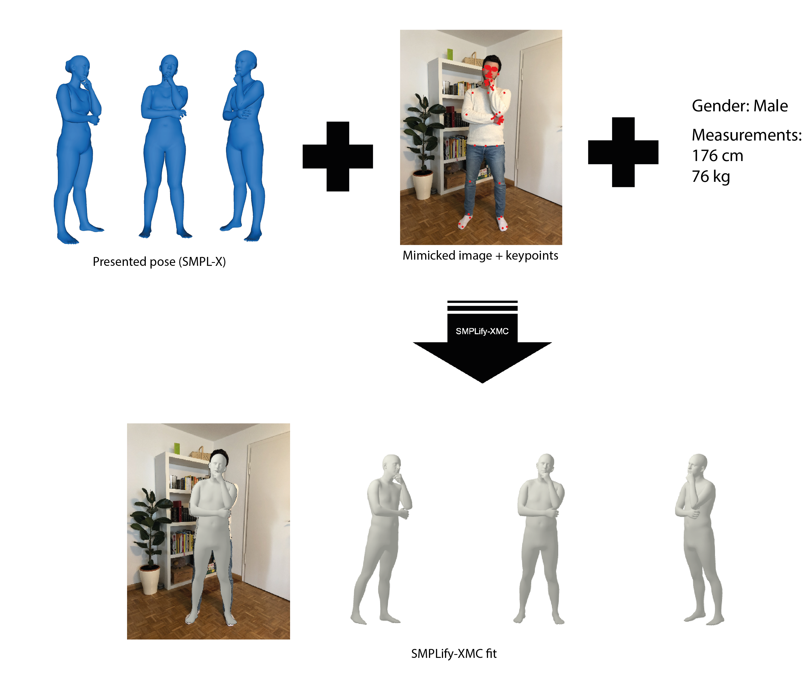

# Smplify-XMC
This repo is part of our project: On Self-Contact and Human Pose. \
[[Project Page](https://tuch.is.tue.mpg.de)] [[Paper](https://arxiv.org/pdf/2104.03176.pdf)] [[MPI Project Page](https://www.is.mpg.de/publications/mueller-cvpr-2021)]




## License
Software Copyright License for **non-commercial scientific research purposes**. Please read carefully the following [terms and conditions](https://github.com/muelea/smplify-xmc/blob/master/LICENSE) and 
any accompanying documentation before you download and/or use the TUCH data and software, (the "Data & Software"), including 3D meshes, images, videos, textures, software, scripts, and animations. 
By downloading and/or using the Data & Software (including downloading, cloning, installing, and any other use of the corresponding github repository), you acknowledge that you have read these 
terms and conditions, understand them, and agree to be bound by them. If you do not agree with these terms and conditions, you must not download and/or use the Data & Software. Any infringement 
of the terms of this agreement will automatically terminate your rights under this [License](./LICENSE).


## Description and Demo

SMPLify-XMC adapts [SMPLify-X](https://github.com/vchoutas/smplify-x) to fit SMPL-X model to Mimic The Pose (MTP) data. To run SMPLify-XMC you need
- an image of a person mimicking a presented pose
- the presented pose parameters
- the person's gender, height and weight
- the [OpenPose](https://github.com/CMU-Perceptual-Computing-Lab/openpose) keypoints.

The code has been tested with Python 3.6.9, CUDA 10.1, CuDNN 7.5 and PyTorch 1.8.1 on Ubuntu 18.04.


## Installation

#### 1) Clone this repo
```
git clone git@github.com:muelea/smplify-xmc.git
cd smplify-xmc
```

#### 2) Download body model 

Download them SMPL-X body model from [https://smpl-x.is.tue.mpg.de](https://smpl-x.is.tue.mpg.de) and save it in MODEL_FOLDER.
You can replace `model_folder: MODEL_FOLDER` in the config file configs/fit_smplx_singleview.yaml or use an environment variable.

#### 3) Download essentials 

Download essentials from [here](https://download.is.tue.mpg.de/tuch/smplify-xmc-essentials.zip) and unpack to ESSENTIALS_DIR. Then create 
symlinks between the essentials and this repo:
```
ln -s $ESSENTIALS_DIR/smplify-xmc-essentials data/essentials
```

#### 4) Create python virtual environment 
```
python3 -m venv $YOUR_VENV_DIR/smplify-xmc
source $YOUR_VENV_DIR/smplify-xmc/bin/activate
```

#### 5) Install requirements 
`pip install -r requirements.txt`

#### 6) Get dependencies
Clone self-contact repo, e.g. to YOUR_PYTHON_PACKAGE_DIR.
Then use pip to install the package. Then you can import
the self-contact functions from any place in your system. 
(make sure your venv is activated).
```
cd $YOUR_PYTHON_PACKAGE_DIR
git clone git@github.com:muelea/selfcontact.git
cd selfcontact
rm -r .git
pip install .
cd ..
```


### Demo using our example data

You can find our example dataset in this repo under `data/example_input`. 
The following command will automatically save parameters, mesh, and image under output_dir:
```
python main_singleview.py --config configs/fit_smplx_singleview.yaml \
--dataset mtp_demo \
--input_base_dir data/example_input/singleview/subject1 \
--input_dir_poses data/example_input/presented_poses \
--output_dir data/example_output/singleview/subject1 \
--model_folder $MODELS_FOLDER
```

### Process the MTP dataset:

Download MTP data from the TUCH website: https://tuch.is.tue.mpg.de and save the data in DS_DIR.
You should now see a folder named $DS_DIR/mtp.

Read MTP data: `python lib/dataextra/preprocess_mtp_mturk_dataset.py --ds_dir=$DS_DIR/mtp` 

Process the first item: `python main_singleview.py --config configs/fit_smplx_singleview_mtp_dataset.yaml --db_file data/dbs/mtp_mturk.npz --output_dir data/example_output/mtp/ --model_folder=$MODEL_FOLDER --cluster_bs=1 --ds_start_idx=0`

### Process your own data:
Follow the structure of the example data in data/example_input.
Create a folder PP_FOLDER for the presented poses:
```
PP_FOLDER
  ----pose_name1.pkl
  ----pose_name2.pkl
```

The pickle file should contain a dictionary with the pose parameters and the vertices.
If you include the vertices ('v'), the vertices in contact will be computed automatically. 
```
data = {
  'body_pose': ..
  'right_hand_pose': ..
  'left_hand_pose': ..
  'global_orient': ..
  'v': .. #vertices

}
```
Then create a folder MI_FOLDER for the mimicked images, following the structure below. Compute the keypoints
for each image from [OpenPose](https://github.com/CMU-Perceptual-Computing-Lab/openpose). The meta file should
contain the gender, height and weight of the subject mimicking the pose.
```
MI_FOLDER
  ----subject_name1
    ----images
      ----pose_name1.png
      ----pose_name2.png
    ----keypoints
      ----pose_name1.json
      ----pose_name2.json
    ----meta.yaml
``` 

Finally, run the fitting code:
```
python main_singleview.py --config configs/fit_smplx_singleview.yaml \
--input_base_dir $MI_FOLDER/subject_name1 \
--input_dir_poses $PP_FOLDER \
--output_dir data/example_output/subject_name1
```


## Citation
```
@inproceedings{Mueller:CVPR:2021,
  title = {On Self-Contact and Human Pose},
  author = {M{\"u}ller, Lea and Osman, Ahmed A. A. and Tang, Siyu and Huang, Chun-Hao P. and Black, Michael J.},
  booktitle = {Proceedings IEEE/CVF Conf.~on Computer Vision and Pattern Recogßnition (CVPR)},
  month = jun,
  year = {2021},
  doi = {},
  month_numeric = {6}
}
```


## Acknowledgement 

We thank Vassilis Choutas and Georgios Pavlakos for publishing the SMPLify-X code: https://github.com/vchoutas/smplify-x.
This has allowed us to build our code on top of it and continue to use important features, such as the prior or optimization. 
Again, special thanks to Vassilis Choutas for his implementation of the generalized winding numbers and the measurements code.
We also thank our data capture and admin team for their help with the extensive data collection on Mechanical Turk and 
in the Capture Hall. Many thanks to all subjects who contributed to this dataset in the scanner and on the Internet. Thanks to 
all PS members who proofread the script and did not understand it and the reviewers, who helped improving during the rebuttal.
Lea Mueller and Ahmed A. A. Osman thank the International Max Planck Research School for Intelligent Systems (IMPRS-IS) 
for supporting them. We thank the wonderful PS department for their questions and support.


## Contact

For questions, please contact tuch@tue.mpg.de

For commercial licensing (and all related questions for business applications), please contact ps-licensing@tue.mpg.de.